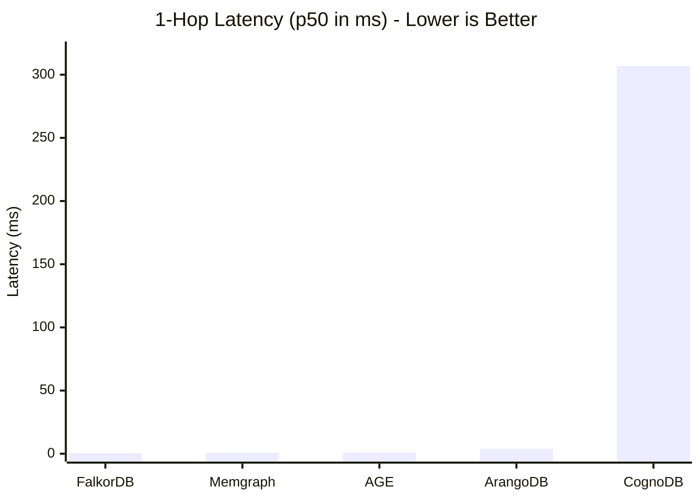

# CognoDB Graph Database Benchmark

This is a benchmark comparing the free tier of **CognoDB Cloud** against four self-hosted graph databases: **FalkorDB**, **Memgraph**, **ArangoDB**, and **Apache AGE**.

## Why these four?
I wanted to see how different architectures handle being starved of resources (specifically, 0.5 vCPUs and 512 MB RAM). 
- **FalkorDB & Memgraph**: In-memory, true graph engines. Good for testing pure index-free adjacency.
- **ArangoDB**: A multi-model (document + graph) database.
- **Apache AGE**: Cypher queries running on top of PostgreSQL.

---

## Methodology

To keep things fair, the four self-hosted databases are capped via Docker to exactly match CognoDB's `c0` free tier limits. Comparing a managed cloud instance to an uncapped local Docker container is basically just benchmarking hardware differences, so we forced parity here.

We ran the client runner locally. That means the local Docker containers ran on `localhost`, while CognoDB was queried over the public internet. Warm-up iterations were run for read queries to stabilize the cache before taking measurements.

### Resource Limits
Everything is strictly limited to **0.5 vCPUs** and **512 MB RAM**.

| Database | Setup | vCPU | RAM | Storage |
| :--- | :--- | :--- | :--- | :--- |
| **CognoDB** | Cloud (c0 tier) | 0.5 (Burstable) | 512 MB | 1 GB |
| **FalkorDB** | Docker | 0.5 (Hard limit) | 512 MB (Hard limit) | 1 GB |
| **Memgraph** | Docker | 0.5 (Hard limit) | 512 MB (Hard limit) | 1 GB |
| **ArangoDB** | Docker | 0.5 (Hard limit) | 512 MB (Hard limit) | 1 GB |
| **Apache AGE** | Docker | 0.5 (Hard limit) | 512 MB (Hard limit) | 1 GB |

---

## The Dataset

We used the [SNAP email-Enron](http://snap.stanford.edu/data/email-Enron.html) network. It's a solid, realistic dataset that fits comfortably in the 512 MB RAM constraint.
- **Nodes (Emails):** 36,692
- **Relationships (Comms):** 183,831

*Note: We created an index on `nodeId` across all platforms before running the read workloads.*

---

## Benchmark Results

### Visual Summary: 1-Hop Latency (p50)

### 1. Ingest Throughput
| Database | Total Load Time (sec) | Nodes/sec | Relationships/sec |
| :--- | :--- | :--- | :--- |
| **CognoDB** | 212.97 | 1,628 | 1,930 |
| **FalkorDB** | 44.17 | 133,226 | 8,375 |
| **Memgraph** | 20.69 | 20,506 | 19,445 |
| **ArangoDB** | 13.36 | 43,943 | 29,340 |
| **Apache AGE** | 240.66 | 78,346 | 1,530 |

### 2. Cold vs. Warm Start (1-Hop Latency)
*Comparing the very first un-cached query (p50) against the warmed-up state.*

| Database | Cold Start (ms) | Warm Start (ms) | Difference |
| :--- | :--- | :--- | :--- |
| **CognoDB** | 314.09 | 306.95 | Minimal (Network bound) |
| **FalkorDB** | 0.92 | 0.42 | -54% |
| **Memgraph** | 1.78 | 0.69 | -61% |
| **ArangoDB** | 4.46 | 3.95 | -11% |
| **Apache AGE** | 1.54 | 1.02 | -34% |

### 3. Traversal Latency
*Measured across 100 iterations from random start nodes. We tracked both median (p50) and the 95th percentile (p95) to spot variance.*

| Database | 1-Hop (p50 / p95) ms | 2-Hop (p50 / p95) ms | 3-Hop (p50 / p95) ms |
| :--- | :--- | :--- | :--- |
| **CognoDB** | 306.95 / 310.40 | 307.93 / 1242.00 | 2025.01 / 4768.84 *(77 err)* |
| **FalkorDB** | 0.42 / 0.71 | 0.81 / 4.80 | 10.20 / 59.33 |
| **Memgraph** | 0.69 / 1.50 | 1.45 / 47.32 | 48.80 / 493.87 |
| **ArangoDB** | 3.95 / 4.52 | 6.54 / 67.99 | 304.39 / 6328.20 |
| **Apache AGE** | 1.02 / 1.32 | 2.96 / 46.32 | 133.14 / 3015.34 |

### 4. Lookups & Aggregations

| Database | Point Lookup (p50 / p95) ms | Indexed Filter (p50 / p95) ms | Aggregation (p50 / p95) ms |
| :--- | :--- | :--- | :--- |
| **CognoDB** | 307.56 / 410.93 *(78 err)* | 307.04 / 409.84 | 818.32 / 921.47 |
| **FalkorDB** | 0.33 / 0.62 | 5.97 / 53.15 | 425.46 / 479.58 |
| **Memgraph** | 0.76 / 1.43 | 8.76 / 59.79 | 202.31 / 252.27 |
| **ArangoDB** | 3.22 / 4.35 | 3.30 / 4.16 | 176.22 / 190.92 |
| **Apache AGE** | 0.43 / 0.93 | 0.37 / 0.72 | 1085.07 / 1096.84 |

### 5. Mixed Workload Concurrency
*80% read / 20% write mix at different concurrent client counts.*

| Database | 1 Client | 10 Clients | 40 Clients |
| :--- | :--- | :--- | :--- |
| **CognoDB** | 3 req/sec | 35 req/sec | 146 req/sec |
| **FalkorDB** | 3,394 req/sec | 3,307 req/sec | 2,847 req/sec |
| **Memgraph** | 1,148 req/sec | 1,433 req/sec | 1,375 req/sec |
| **ArangoDB** | 270 req/sec | 741 req/sec | 903 req/sec |
| **Apache AGE** | 2,233 req/sec | 2,668 req/sec | 2,531 req/sec |

### 6. Footprint (Resource Usage)
*Note: Docker wouldn't expose internal memory metrics to our script during the run, so the self-hosted platforms threw an error state for observability here.*

| Database | Stored Data Size (Disk) | Memory Usage (Idle) |
| :--- | :--- | :--- |
| **CognoDB** | Not Observable | Not Observable |
| **FalkorDB / Memgraph / ArangoDB / AGE** | Not Observable | Not Observable |

---

## Honest Caveats

- **Network Ping vs `localhost`:** We ran the client locally. That means the Docker containers had a network latency of ~0ms (`localhost`), while CognoDB queries had to travel over the public internet. That ~307ms floor you see on CognoDB isn't database latency; it's just ping and TLS overhead. 
- **Free-Tier Limits:** CognoDB timed out and threw errors on deep 3-hop traversals (77 errors) and point lookups (78 errors). This is almost certainly because we hit their strict query timeouts or compute limits enforced on the `c0` free tier.
- **The CPU Bottleneck:** Capping the Docker containers at 0.5 vCPU meant they had terrible multi-threading. Look at the Mixed Workload table: throughput for FalkorDB actually drops when we push it to 40 clients. They were thrashing on context switches because they didn't have enough CPU cores to handle the concurrency.

---

## Quick Analysis

### 1. Data Loading
ArangoDB won the ingest race (13.3s). It bypasses standard query overhead by using a dedicated HTTP `collection.import()` API. Memgraph (20.6s) was right behind it using Bolt `UNWIND` batches. CognoDB and Apache AGE struggled here, taking a few minutes to load. For CognoDB, that's just the network roundtrip penalizing every batch; for AGE, it's the overhead of mapping graph data into Postgres tables.

### 2. Deep Traversals
The 3-hop traversal separates true graph databases from the rest. 
FalkorDB (10ms) and Memgraph (48ms) use index-free adjacency. The graph is stored as memory pointers, so a 3-hop query is just jumping through memory addresses. ArangoDB (304ms) and AGE (133ms) don't have this. They have to do a traditional index lookup for every single relationship at every hop, which kills performance as the tree gets wider.

### 3. Concurrency
FalkorDB had the highest raw throughput at low concurrency (3,394 req/sec). But because of the strict 0.5 vCPU limit, every local database hit a compute wall and stopped scaling around 10-40 clients. CognoDB is slower overall due to the network, but it scaled up cleanly (from 3 to 146 req/sec). Its burstable cloud setup and connection pooling handled the concurrent pressure much better than half-a-core of a local Docker container.

---

## How to Run This

1. **Install:** `npm install`
2. **Get Data:** `node scripts/downloadData.js`
3. **Start DBs:** `docker compose up -d`
4. **Config:** Copy `.env.example` to `.env` and drop in your CognoDB c0 URI and password.
5. **Run:** `npm run benchmark`
